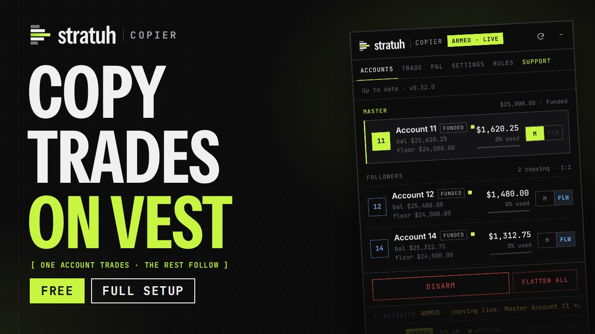
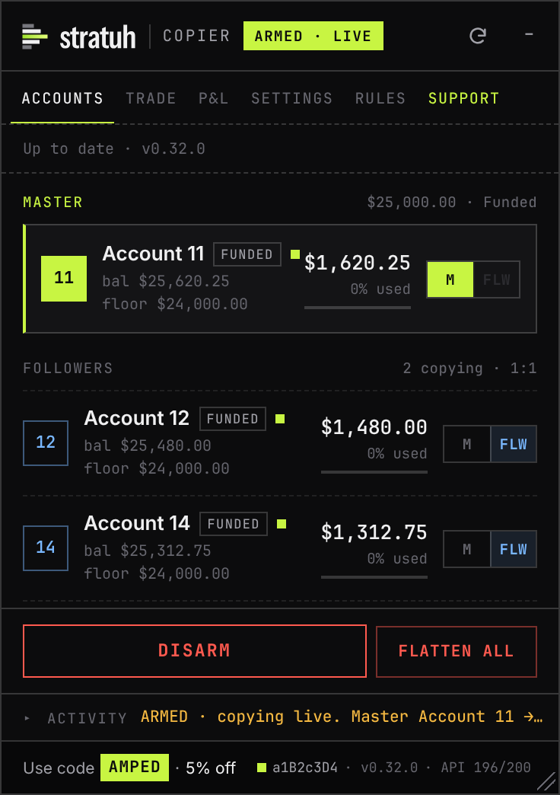
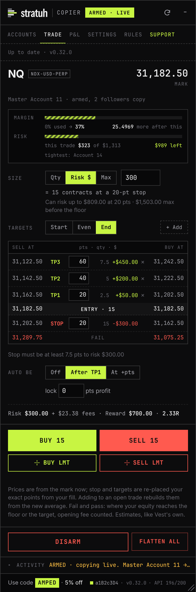

# STRATUH Copier

**[Watch the 6-minute setup video on YouTube](https://youtu.be/EMpVqls6D8o)** (recorded before the new look; the
steps are the same)

Trade copier for prop accounts on [Vest Markets](https://next.vestmarkets.com). One account leads, the others mirror
it. Runs as a Tampermonkey userscript inside the Vest page. Part of STRATUH, my trading tools. It used to be called
Vest Copier; same script, same link, new look.

  
  &nbsp;
  

## A copy, start to finish

Say Account 11 is your master and Accounts 12 and 14 follow it.

1. You buy 1 NQ on Account 11 with a 20 point stop and two targets.
2. About a third of a second later, 12 and 14 each buy 1 NQ with the same stop and targets.
3. You move the stop to breakeven on 11. Their stops move to the same price.
4. You add half a contract. They add half a contract.
5. You close. They close, and the log tells you each account filled and how far apart the fills were.

If 12 and 14 are smaller than 11, turn on Cap-to-fit and they trade a proportional size instead, with the same stop
distance, so every account risks the same percent.

> [!WARNING]
> These are live orders on real accounts. When the copier is armed, whatever you do on the master happens on every
> follower, mistakes included. Try it with the minimum size before anything else.

## Getting it running

You need a desktop browser (Chrome, Edge, Brave or Firefox). Five steps, about five minutes:

1. **Add Tampermonkey from your browser's store.** It's free; click **Add** on the store page.
   - Chrome or Brave: [Chrome Web Store](https://chromewebstore.google.com/detail/tampermonkey/dhdgffkkebhmkfjojejmpbldmpobfkfo)
   - Edge: [Edge Add-ons](https://microsoftedge.microsoft.com/addons/detail/tampermonkey/iikmkjmpaadaobahmlepeloendndfphd)
   - Firefox: [Firefox Add-ons](https://addons.mozilla.org/firefox/addon/tampermonkey/)

   Get it from the store links above, not from download buttons on other sites (some are ads for other software).
2. **Chrome, Edge or Brave only:** go to `chrome://extensions`, click **Details** under Tampermonkey and switch
   **Allow User Scripts** on. It's off by default, and the copier won't run without it. Firefox skips this step.
3. **Install the copier:** open
   **[vest-copier.user.js](https://github.com/xAmped/Vest-Copier/releases/latest/download/vest-copier.user.js)**.
   Tampermonkey shows an install page. Click **Install**.
4. **Open Vest:** log in at [next.vestmarkets.com](https://next.vestmarkets.com). The STRATUH Copier panel opens in
   the top right. Read the risk notice and accept it.
5. **Pick your accounts and arm:** on **Accounts**, press **M** on your lead account and **FLW** on each account you
   want copying it, then press **ARM**. From now on, trade the lead account as usual. **DISARM** stops copying;
   positions stay as they are.

Stuck? Watch the [6-minute setup video](https://youtu.be/EMpVqls6D8o) or ask in the
[Discord](https://discord.gg/Aa69y9KnM3).

The [tutorial](https://xamped.github.io/Vest-Copier/tutorial/) walks through setup with screenshots, the
[quick-start PDF](docs/Vest-Copier-Quick-Start.pdf) fits it on one page, and the [user guide](docs/USER-GUIDE.md) goes
through every button.

## The panel

| Tab | What's there |
|---|---|
| Accounts | Your master on top, then the followers, with balance, floor and room left. Pick the master and followers here. |
| Trade | An order ticket in points for the market Vest is showing. Two bars up top show how much of Vest's buying power you're using and what your stop would cost against the room to your floor. Stop, entry and targets sit in one price ladder, Sell prices on the left and Buy prices on the right. Size by contracts, by dollars at risk or at the max the account allows. Market orders, or limit orders priced with a click on Vest's chart. Once you're in, Breakeven, Close and add buttons (+25%, +50%, +100% or the most that fits) sit right above. |
| P&L | Profit or loss per account and in total, what you'd keep after each funded account's profit split, and **Claim all profit**: one preview, one confirm, and every funded account's profit is claimed to your Primary Account. |
| Settings | Fast mode, Auto-flatten, Cap-to-fit, update checks, and the AMPED code switch. |
| Rules | What the copier will and won't do, and the risk notice. |
| Support | Report a problem, share an idea, the Discord, links to the guides, and the AMPED code. |

At the bottom: **ARM / DISARM**, a red **Flatten All** that instantly closes everything on every account (no
confirmation; the copier stays armed, so it doubles as a quick exit for scalping), and the activity log folded to its
latest line (click it for the full log, **Diag** and **CSV**). The bottom right shows Vest's build, your version and
the API budget.

## Things it won't do

- It won't copy a trade you placed while it was disarmed, and it won't open a follower into a trade that's already
  running. (If master and followers already hold the same position, arming takes it over.)
- It won't copy an order Vest rejected on the master.
- It won't copy closes Vest makes by itself, such as a drawdown breach on the master. Those followers stay open until
  you close them or press Flatten All.
- It won't loosen your stop when you add: the targets rebuild from the new average, a tighter stop stays put.
- It won't arm right after Vest changes its website until you've run the quick read-only check (click the status in
  the bottom right).

## Troubleshooting

| Symptom | Fix |
|---|---|
| No panel on the Vest page | Allow User Scripts is off (step 2 of Getting it running), or the script is disabled in Tampermonkey. Refresh after fixing. |
| FLW is greyed out | That account is a different size from the master. Turn on Cap-to-fit in Settings. |
| ARM refuses | The log names the account and the reason, usually a resting order or an opposite position. Clear it on Vest and arm again. |
| "did NOT fill" in the log | Vest accepted the order but didn't execute it, usually not enough margin for that size. The margin bar on the Trade tab shows how much fits. |
| Breakeven stays grey | Price has to be clear of your entry first (Vest refuses a stop the bid or ask has already passed). Hover it for the reason. |
| Amber status in the bottom right | Vest updated its site. Click it, let the check finish, then Accept. |
| Need a hand | Ask in the [Discord](https://discord.gg/Aa69y9KnM3). |
| Anything else | Open the **Support** tab and use Report a problem. It saves a report file and opens a pre-filled [GitHub issue](https://github.com/xAmped/Vest-Copier/issues); drag the file in. The file has sizes, prices and balances but no login data. |

## Updates

New versions show up as a bar just under the panel's tabs. Click **Install**, confirm in Tampermonkey, switch back to Vest and
the page reloads with the new version. The [changelog](CHANGELOG.md) lists what each one changed.

## About the AMPED code

The copier doesn't cost anything. I keep it running in my spare time, so if you were going to buy a Vest evaluation anyway,
code **AMPED** takes 5% off and sends a small commission my way.

You'll be asked about it once. If you agree, the copier enters AMPED in the discount field of Vest's checkout window
whenever it opens, replacing any code that was there, and logs the change. If your account already uses a code, the
question names it so you can decline. Settings → Support turns the switch off.

## Privacy

The script runs in your browser tab and uses the Vest session you're already logged into. Your orders go to Vest and
nowhere else. The only outside request is to this repository, to see if a newer version exists.

## Terms

Use it on your own accounts and pass it along unchanged, both free. Selling it, renaming it or releasing an edited
copy is off limits. The full wording lives in [LICENSE](LICENSE), and [DISCLAIMER.md](DISCLAIMER.md) covers the risk
you take on by using it. Independent project by xAmped; Vest Markets has no part in it.
